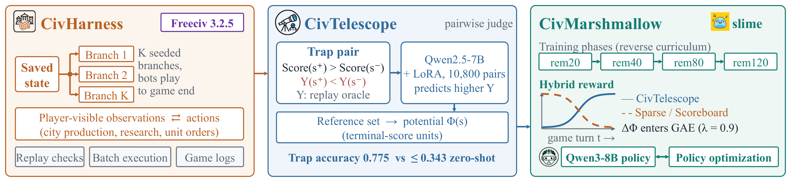

# Rome Wasn’t Built in One Turn: Replay-Grounded Reward Signals for Long-Horizon Freeciv Agents

Official respository of paper: "Rome Wasn’t Built in One Turn: Replay-Grounded Reward Signals for Long-Horizon Freeciv Agents"

## Abstract

Training language-model agents to play long-horizon strategy games is hard because deterministic feedback is sparse and often arrives only at the end of a game.
In-game scores can offer dense signals, but they do not reliably predict future outcomes: in 8–68% of position pairs across eight strategy games, the higher-scoring position leads to the worse outcome.
We term this phenomenon *scoreboard traps*.
In Freeciv, an open-source turn-based empire-building game where several players manage units, cities, and diplomacy over hundreds of turns, we look into better reward signals for gameplay agents.
To facilitate this, we build **CivHarness**, an open system that saves current game states, branches on different decisions, and replays the game to future turns to provide measurable long-horizon feedback from saved positions.
We use CivHarness to train **CivTelescope**, an LLM Judge that predicts which one of two game positions will yield the better outcome.
On scoreboard-trap pairs, CivTelescope is 1.3–2.0 times more accurate than off-the-shelf language models, and it generalizes to new game starts, later turns, and unseen rules.
We then train a Freeciv gameplay agent with CivTelescope as a dense reward, and call this recipe **CivMarshmallow**.
When used in the middle stage of the game where scoreboard traps are common, CivMarshmallow reaches an average training phase gain of 8.94 points, 77% more than the best baseline, the end-of-game reward.
Over the full 120-turn game, CivMarshmallow uses a hybrid reward that starts from the scoreboard or the end-of-game reward and shifts to CivTelescope as the game advances; this hybrid reward scores highest among the rewards we compare.

**Overview of CivHarness, CivTelescope, and CivMarshmallow.**
CivHarness branches saved Freeciv states and exchanges player-visible observations and actions with the agent.
CivTelescope, a pairwise judge trained on replay-labeled trap pairs, gives a potential Φ(s) through a reference set.
CivMarshmallow trains the policy in four phases with CivTelescope reward, and with a hybrid reward for full games.
